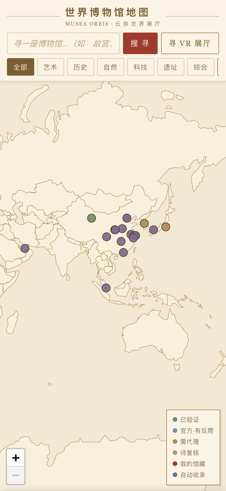

# 世界博物馆地图 · Musea Orbis 🏛️

一张可以「走进去」的世界博物馆地图：在古典风格的地图上点击全球各大博物馆，
直接进入其 VR 全景展厅；遇到看不懂的外文页面可一键整页翻译。



## ✨ 功能

- 🗺️ **世界地图**：Leaflet + 本地矢量国界（零瓦片依赖，离线可用），羊皮纸古典风格
- 🌍 **3D 地球模式**：Globe.gl 古董地球仪，一键切换平面/球体
- 🚪 **VR 展厅内嵌**：点击标记 → 应用内 iframe 直接开馆；自动检测 X-Frame-Options /
  CSP frame-ancestors，遇防嵌入站点给出「译文阅览 / 仍试内嵌 / 前往本站」三种退路
- 📜 **整页翻译**：内置网页代理（剥离 CSP、URL 重写）+ MyMemory 机翻（自动检测源语言），
  意大利语/俄语/日语馆页也能读
- 🔍 **在线发现**：输入任意博物馆名，后端经必应多路查询 + 相关性过滤 + 官网 VR 嗅探，
  找到它的虚拟展厅链接，一键「收入地图」（点击地图落点，自动持久化）
- 🏺 **分类筛选**：艺术 / 历史 / 自然 / 科技 / 遗址 / 综合 六类筛选
- 📱 **移动优先**：iPhone 全屏体验优化

## 🚀 快速开始

```bash
cd museum-map
python3 server.py        # 或 sh start.sh
# 打开 http://localhost:8765/
```

无需任何第三方依赖：后端只用 Python 标准库，前端库全部本地化（static/）。

## 🌐 静态版（GitHub Pages）

`docs/` 目录是可直接部署的静态版（内嵌 52 馆数据，支持地图/地球/内嵌展厅，
在线发现与翻译等后端功能自动禁用）。在仓库 Settings → Pages 选择 `docs/` 目录即可。

## 📂 结构

```
├── index.html        # 单文件前端（地图/地球/搜索/展厅/面板）
├── server.py         # 后端：数据 API + 必应发现 + 翻译 + 网页代理（仅标准库）
├── museums.json      # 基础馆藏数据（24 馆，人工核实）
├── custom.json       # 用户收录
├── auto.json         # 批量自动收录（expand.py 产出，27 馆）
├── expand.py         # 批量发现管线（必应查询 + 相关性过滤 + VR 嗅探）
├── build_static.py   # 生成 docs/ 静态版
├── static/           # Leaflet / three.js / globe.gl / 世界国界 GeoJSON
└── docs/             # GitHub Pages 静态版
```

## ⚠️ 说明

- 翻译基于 MyMemory 免费接口（匿名配额有限），译文仅供辅助理解
- Google Arts & Culture 系列链接在中国大陆需代理访问（数据中已标注）
- 部分馆官网禁止 iframe 嵌入，应用内会优雅降级
